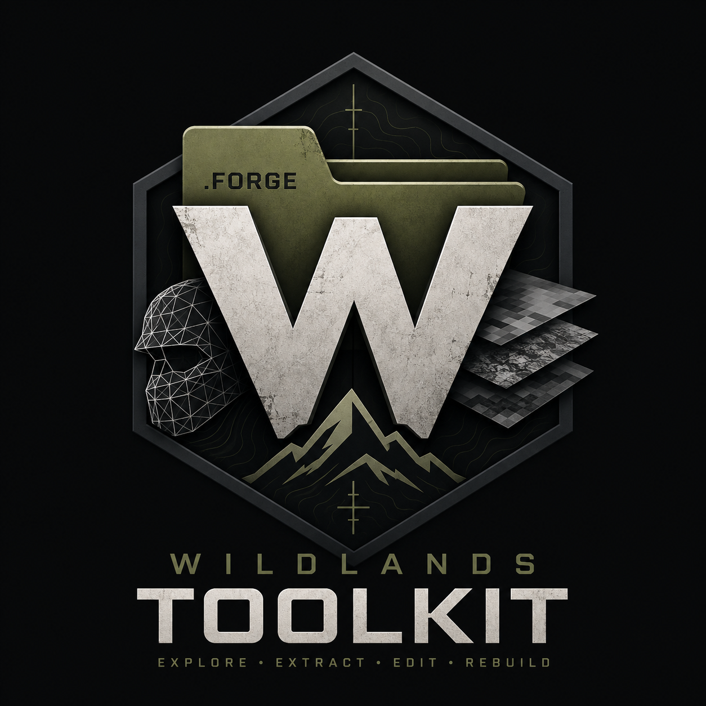

<p align="center">
  
</p>

# (Probably) the first Ghost Recon Wildlands Toolkit

An open modding tool for **Tom Clancy's Ghost Recon Wildlands**. It opens the game's
`.forge` archives, shows what is inside them, and writes changes back so that you can
modify your game.

> **Downloads are on the [Releases](../../releases) page.**
> Building from source is only needed if you want to change something on your own.

---

## !!! IMPORTANT !!!: One thing that can waste your evening

**The same resource often sits in several archives.** `W_ASR_AK47_body_LOD0` exists four times,
byte for byte identical, in `DataPC.forge`, `DataPC_patch_01.forge`, `DataPC_20_dlc.forge` and
`DataPC_29_dlc.forge`. Change one and the game may still load another, and it looks exactly like
your mod did nothing.

---

## What's new in 0.2.0

Version 0.2.0 is the largest Toolkit update so far. The main additions are:

- A complete mesh workflow: export a game mesh as glTF, edit it in Blender and import it back
- Persistent mod projects and portable `.wlmod` packages that can be reviewed before installation
- Adding and deleting individual resources or complete `.data` containers
- A dedicated Changes window with grouped operations, pending-change markers and safer archive writes
- Automatic skeleton discovery for rigged exports, plus improved FBX and OBJ export
- Background archive loading, full DLC archive discovery and an exact cross-archive copy finder
- Redesigned mesh and texture viewers, update notifications and recoverable crash reports

The experimental BuildTable editor is intentionally disabled in this release. BuildTable resources
can still be inspected, extracted and replaced as raw resources.

See [CHANGELOG.md](CHANGELOG.md) for the complete list of additions, changes, fixes and current
limitations.

---

## Features

Note: because most of you probably will not read all of that, here is the short version on meshes.
You **can** now replace the geometry of a mesh that already exists: export it as glTF, edit it in
Blender, import it back. Skin weights, every uv set and vertex colours survive the trip, and the
number of draw ranges is allowed to change.

**And it has been confirmed in the running game.** The body of an AK-12 was exported, scaled five
times over in Blender, imported back, and the game draws it: geometry intact down to every tooth of
the picatinny rail, textures sitting where they belong, lighting and shadows correct, the weapon
still held properly in the hands. That mesh is vertex format 2, the richest one in the game, with
three uv sets and vertex colours.

Changes can be made without a project, or inside an optional mod project. A project keeps
every changed, added or newly created Forge resource across Toolkit restarts and builds the exact
tested revision as a portable `.wlmod` package. Opening a `.wlmod` resolves those operations against
the recipient's game archives, reports missing or conflicting resources, and queues the complete mod
for one normal, backed-up **Apply** action.

Free Mode and mod projects are separate workspaces. Pending Free Mode changes are discarded only
after confirmation when a project is opened; they are never imported into that project. Leaving or
switching a project removes its changes from the current workspace but keeps them in its project
folder. Reopening the project shows its saved operations again, including operations that are already
applied to the local game.

The **Changes** window lists those edits as the actions the user performed, not as an unexplained pile
of internal writes. A complete attachment addition remains one change even when it touches dozens
of resources. Pending changes can be opened again or removed before Apply; saved project operations
remain listed after Apply so the project's contents do not disappear from the UI.
Existing resources with queued changes carry an **EDITED** or **REMOVED** marker in the browser.

### Archives

- Opens every `.forge` of the game and lists its entries, **including the ones in the `dlc_*` folders**
  (23 archives in a full install, not just the 10 in the main folder)
- Searches neighbouring archives in the background, so a resource is found even when it lives in a different archive or file
- Right-click any resource and choose **Find copies in game...** to scan every installed archive for the same exact 64-bit resource ID. Results name the archive and data container for each confirmed copy; the scan never guesses from filenames.
- Adds a raw resource to an existing `.data` container by cloning the binary layout of a compatible
  resource already present in that container
- Adds a complete `.data` container to a Forge archive and updates the archive metadata required to
  keep it addressable
- Deletes individual resources or complete `.data` containers after an explicit warning; deletions
  remain queued until **Apply changes** like every other edit
- **Replaces any resource with a raw file**, whatever its type: drop a `.Skeleton` or a `.BuildTable`
  straight in, from your own tools or from somewhere else. Bigger and smaller files are both fine
- Before it accepts a raw file it checks the type, the id and whether it still reads back, and says
  what is wrong instead of quietly breaking the archive
- Writes changes back into the game files

### Textures

- Views every texture the game ships
- Shows each mip level on its own, including the ones streamed from other archives or files
- Red, green, blue and alpha can be switched off separately in the viewer, as well as the background
- Exports as PNG, JPEG, BMP, TIFF or DDS
- **Replaces textures** and writes every affected resource, streamed mips included

Note: A DDS in the format and size of the target goes through untouched, everything else is encoded again

### Meshes

- 3D viewport with orbit, pan and zoom, built on WPF's own 3D
- Draws the real diffuse texture per draw range, back faces follow the original used material
- Exports and **re-imports binary glTF** (`.glb`): positions, normals, tangents, every UV set,
  vertex colours, skin weights and one material per draw range, all of it round-trips
- Imports the active glTF scene rather than every mesh stored in the file, applies nested object
  transforms, supports interleaved and multiple buffers, and keeps tangent handedness across mirrored
  UVs and mirrored object transforms
- Validates triangle topology, accessor bounds, attribute counts and skin ownership before touching a
  game resource. Unsupported compression extensions and unapplied morph targets stop with an explicit
  explanation instead of producing malformed geometry
- Exports **binary FBX** with skeleton and skin, without the Autodesk SDK. Static props and vehicle
  parts export directly without an irrelevant skeleton prompt
- Exports and re-imports Wavefront OBJ as well, for tools that want it
- Finds the matching skeleton across all archives through a bone name index, and uses it to give
  both FBX and glTF a real bone hierarchy instead of a flat list. **98.8% of skinned meshes do not
  ship their skeleton next to them**, so that index is what makes a usable rig possible at all
- Reads and writes `Mesh`, `Skeleton` and `BuildTable` **byte for byte**: 20450, 1662 and 3649
  resources of `DataPC.forge` come back out identical
- The skeleton reader is checked against the published AnvilNext documentation from Firejumper93, which you can find [here](https://github.com/Firejumper93/GhostReconWildlands-AnvilNext2.0-Documentation), hash for hash and
  invariant for invariant

**Use glTF if you want the mesh to come back.** FBX export is still there and it carries the
skeleton and the skin, but glTF is the one that survives the round trip without losing anything.
OBJ works too and is the smallest common denominator, but it cannot carry skin weights, several
uv sets or vertex colours, so on a skinned mesh the toolkit has to guess the weights from the old
shape. It tells you when it does that.

### Materials and appearance

- Reads the parameter list of a material with resolved names and the textures it names
- Resolves texture sets to their textures
- Reads and rewrites `.BuildTable` resources byte for byte, all 3649 of them

The interactive BuildTable editor is temporarily disabled and is not part of the current release.
BuildTable resources can still be inspected, extracted and replaced as raw resources.

### Weather and lighting

- Editor for `TimeOfDayPropertyControllerData` and `WeatherPropertyControllerData`
- Day curves with their control points: editable, filterable, resettable
- The same curves as editable text, out and back in without losing a byte
- External JSON graphics profiles can be previewed on the exact open controller before they join the change list

### Command line

The Wildlands CLI is part of the project and is also usable for batch and diagnostic work, but the
normal GUI is recommended for regular use. A selected command reference is available at the bottom
of this page.

The `...cycle` commands are the ones I actually trust the formats on. Point them at a folder of
extracted `.data` files and they check the whole lot; see the section above for the numbers.

---

## How much of this is actually tested

"It opens the file" and "it writes the file back correctly" are very different claims, so the CLI
has commands that read every resource of a kind, write it straight back, and compare byte for byte.
Over all of `DataPC.forge`:

| | rewritten | came out different |
|---|---|---|
| Meshes | 20450 | **0** |
| Skeletons | 1662 | **0** |
| BuildTables | 3649 | **0** |

---

## Getting started

1. Download the release and start `Wildlands.Toolkit.exe`
2. On first start it asks for the Wildlands folder. It also offers to index every
   skeleton in the game, which takes a few minutes. Say yes if you ever want to touch a
   character: **98.8% of skinned meshes do not ship their skeleton next to them**, and without
   that index they export as a pile of loose bones instead of a usable rig. Props and vehicle
   parts do not need it. You can decline and do it later
3. Pick an archive on the left, step into an entry and select the resource you want to modify

### Example: Replacing a texture

1. Select the texture, open the texture viewer, press **Replace** in the toolbar (or **Replace...** in the right-click menu)
2. Pick an image. The dialog shows the target format, the mip levels and **which resources will be written**, before you agree to anything
3. The edit appears in **Changes** and is shown right away. Nothing is written yet
4. **Apply** writes every pending change in one pass. The **Changes** window can remove individual
   changes or clear the complete list

### Example: Replacing any other resource

1. Select it, right-click, **Replace with raw resource file...**
2. Pick your file. The toolkit checks that it is the same type, carries the same id and still reads
   back cleanly. If something is off it tells you what, and you can still go ahead
3. **Apply changes** writes it

This is the path for anything the toolkit has no editor for, and for files you built yourself.

### Example: Replacing a mesh

1. Select the mesh and press **Export** in the toolbar (or the button of the same name in the mesh
   viewer). Keep the default `.glb`
2. Edit it in Blender. Every material stays a separate material, and that is what becomes a draw
   range on the way back. You may add or remove one; the material list follows
3. Export it from Blender as glTF binary (`.glb`) again
4. Back in the browser, select the mesh and press **Replace** in the toolbar
5. Same as textures: the change lands on the pile, **Apply changes** writes it

The toolbar has **Export** and **Replace** side by side, so the way back in is as easy to find as
the way out. Everything still goes through the same pile of pending changes, and nothing touches
an archive until you press **Apply changes**.

One thing Blender cannot do for you: the bones. **The skeleton in your file is not imported.** The
mesh keeps the bone table it already has, and your joints are matched back onto it by name - so
leave the armature that came out of the export alone, and do not rename its bones. The toolkit
shows you how many matched before it writes anything. Vertices whose bones do not exist on the target
take the weights of the nearest original point; a wholly foreign or missing rig is rebound that way as
well, and the confirmation dialog warns when the replacement shape makes that approximation risky.

### Example: Building and installing a mod package

1. Leave **Project** set to **None** for one-off experiments, or open its menu and choose **New mod project…**
   before making the changes that should belong to a distributable mod
2. Make and test changes normally. While the project is active, every queued replacement, new
   resource and new Forge container is persisted inside the selected project folder. Its
   `project.wlproj` manifest and `assets` folder together are the editable project
3. Use **Project settings…** to set the release name, author and version, then choose
   **Build .wlmod package…**. The Toolkit warns when the current project revision has not been
   deployed and tested yet
4. A recipient chooses **Install .wlmod package…** or drops one `.wlmod` file anywhere onto the
   main Toolkit window. A modal review shows the package name, author, version, affected archives
   and every grouped change before anything is installed. **Install**
   then shows a final confirmation with the exact archive writes, backup requirement and disk-space
   estimate
5. Confirming that final step writes the mod into the game archives. The same archive backup rules
   apply with or without a project

The current package format stores exact compiled game resources, not Blender or image source files.
It deliberately refuses to overwrite a resource that no longer matches either the clean baseline or
this project's own previous deployment. Automatic multi-mod load ordering, semantic merging of two
mods that edit the same database resource, and uninstalling one mod out of a stack are not implemented
yet; conflicting packages are stopped instead of silently overwriting each other.

---

## Backups & file safety/file integrity

- Before the **first** write to an archive, a copy is made as `<archive>.original` and
  never touched again. That copy always holds the state before the first write, no matter how
  often you write afterwards
- **Close the game before writing.** A running game holds the archive open and prevents writing to it
- Nothing is written until you press **Apply changes** and wait until it shows "Applied in Xs" in the bottom left

---

## Requirements

- Recommended: Windows 10/11 (maybe older work too i haven't tested it)
- [.NET 9 Desktop Runtime](https://dotnet.microsoft.com/download/dotnet/9.0)
- Legit copy of Ghost Recon Wildlands

## Building from source

1. Download the source code
2. Extract the archive and open the `.slnx` file in [Visual Studio 2026](https://visualstudio.microsoft.com/de/downloads)

| Project | What it is |
|---|---|
| `Wildlands.Formats` | The format library. No UI dependency, usable on its own |
| `Wildlands.Toolkit` | The WPF application |
| `Wildlands.Cli` | the command line tool |

## Bug reports / Contact

This program is in early development which means there will probably be bugs or crashes.
Please report any issue you encounter on this Discord server in general chat or send me (Alpha) a DM.
> **[Discord Server](https://discord.gg/bUEkGCCX7t)**

Visit my website [here](https://alphaglyph.dev) to learn more about me and my projects or to get my Discord username.

## Credits

Some information is taken from this Anvil documentation: GhostReconWildlands-AnvilNext2.0-Documentation

---

## For experienced people: Command line reference

```
blobs     <file.data>                       list the compressed blobs of a data file
dump      <file.data> <outdir>              write each decompressed blob to disk
list      <file.forge> [count]              list forge entries
entry     <file.forge> <index> <out>        write one forge entry to disk
res       <file.data> [count]               list the resources inside a data file
get       <file.data> <name> <out>          write one resource to disk
refs      <file.data> <name|0xid>           which resources hold this resource's id
where     <game folder> <name> [--all]      which archives hold a resource (add --all for the world map)
hash      <name> [name...]                  the class hash of a type name
hashscan  <binary> <hash> [hash...]         resolve class hashes from strings kept in a binary

tex       <file.data>                       read every texture in a data file
mips      <file.forge> [name] [n]           show where each mip level comes from
audit     <file.forge> [n]                  count the textures that cannot be shown, and why
recode    <file.forge> [n]                  encode every texture again and measure what was lost
texcycle  <file.forge> [n]                  write every texture out as dds and rebuild it
texout    <file.forge> <filter> <outdir>    write matching textures out as png
texin     <file.forge> <indir>              read a folder of png back in and write the archive

mesh      <file.data> <name>                what a mesh holds
meshes    <file.forge> [n]                  count geometry containers and vertex formats
geometry  <file.forge> [n]                  decode every mesh and check it against its header
ranges    <file.data> <name>                how the index buffer splits over the draw ranges
fbx       <file.data> <name> <out> [cache]  write one mesh as a binary FBX file
gltfout   <file.data> <name> <out.glb>      write one mesh as binary glTF, with skin and uv sets
gltfin    <file.data> <name> <in.glb> <out.data>      replace one mesh's geometry from glTF
gltfcycle <folder|file.data> [n]            export every mesh to glTF, read it back and compare
objout    <file.data> <name> <out.obj>      write one mesh as a Wavefront OBJ file
objin     <file.data> <name> <in.obj> <out.data>      replace one mesh's geometry from an OBJ
objcycle  <folder|file.data> [n]            export every mesh to OBJ, read it back and compare
meshcycle <folder|file.data> [n]            read and rewrite every mesh byte for byte
skeletons <file.forge> [n] [cache.bin]      check every skinned mesh against its skeleton
skelcycle <folder|file.data>                read and rewrite every skeleton byte for byte
skelcheck <folder|file.data>                check skeletons against the published Anvil docs
buildcycle <folder|file.data>               parse and rewrite every build table byte for byte
skelindex <folder> <cache.bin>              index every skeleton across a folder of archives

sets      <file.forge> [n]                  which textures the texture sets point at
mats      <file.forge> [n]                  whether every draw range finds its material
params    <file.forge> [n] [out.txt]        walk every material parameter list
camo      <file.forge> [more.forge...]      match every camo option to its texture
guess     <list.txt> <file.forge> [...]     check candidate names against real hashes

timecycle    <file.data> <name> [out.txt]   write one time cycle out as editable text
settimecycle <file.data> <name> <in.txt> <out.data>   read that text back in
weather      <file.forge> [n]               rewrite every time cycle, byte for byte
weatherprops <file.forge> [n]               census property hashes in weather controllers
profileprops <file.forge> <hash> [...]      show curves for selected property hashes
crackprops   <file.forge> <source> [...]    match unknown hashes against names retained in files
graphicsaudit <file.forge> <out.json>       structured inventory of graphics controllers and curves
guessprops <audit.json> [words.txt] [parts] combine graphics terms and match unknown leaf hashes
graphicsprofile <file.data> <resource> <profile.json> [out.data] preview or apply a profile

pack      <file.data> <out.data>            read a data file, write it back, compare both
setres    <file.data> <name> <in.bin> <out.data>      replace one resource
putentry  <file.forge> <index> <file>       put a file into an archive entry, in place
rebuild   <file.forge> <out.forge>          write every entry again, then compare both
```

---

## License

This project is licensed under the MIT License. See the [LICENSE](LICENSE.txt) file for the full license text.

## Disclaimer

Not affiliated with or endorsed by Ubisoft. Ghost Recon and Wildlands are trademarks of
their respective owners. Use at your own risk. Modding game files can break your
installation, which is what the automatic backup is there for.
